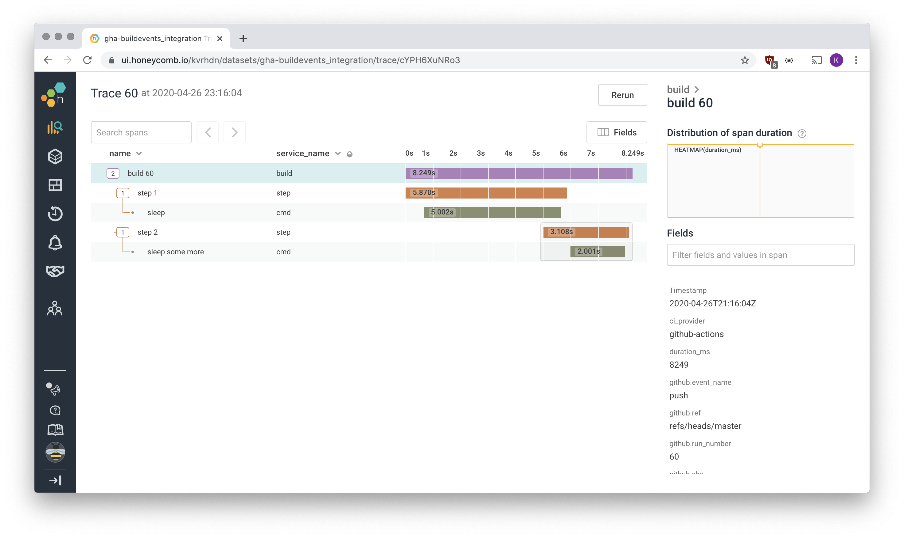

# `gha-buildevents` Action

[![Integration][ci-integration-badge]][ci-integration-link]

[ci-integration-badge]: https://github.com/kvrhdn/gha-buildevents/workflows/Integration/badge.svg
[ci-integration-link]: https://github.com/kvrhdn/gha-buildevents/actions?query=workflow%3AIntegration

This GitHub Action installs and initializes [Honeycomb's buildevents tool][buildevents]. It populates the trace with metadata from the workflow and will always send a trace for the entire build, even if the build failed.

To learn more about buildevents and how to use it, checkout [honeycombio/buildevents][buildevents].

⚠️ This action is still in development, for now use the version from the main branch `kvrhdn/gha-buildevents@main`. I plan to introduce a `v1` tag eventually.

[buildevents]: https://github.com/honeycombio/buildevents

## How to use it

Run the action somewhere in the beginning of your worflow:

```yaml
- uses: kvrhdn/gha-buildevents@main
  with:
    # Required: Honeycomb API key - needed to send traces.
    apikey: ${{ secrets.BUILDEVENTS_APIKEY }}

    # Required: the Honeycomb dataset to use.
    dataset: gha-buildevents_integration

    # Required: the job status, this will be used in the post section and sent
    # as status of the trace. Must always be ${{ job.status }}.
    job-status: ${{ job.status }}

... the rest of your job ...

  # 'buildevents build' will automatically run as a post action.
```

From then on `buildevents` is present on the path. `gha-buildevents` sets an environment varible `TRACE_ID` (this currently defaults to the run number). The build ID should be used with all buildevents commands to ensure the trace is continued.

```yaml
  # Record the start of the step and, for conveniance, set the step ID that will
  # be used for all commands.
- run: |
    echo ::set-env name=STEP_ID::0
    echo ::set-env name=STEP_START::$(date +%s)

  # Wrap the commands that should be traced with 'buildevents cmd'
- run: |
    buildevents cmd $TRACE_ID $STEP_ID sleep-5 -- sleep 5

  # Wrap up the step
- run: |
    buildevents step $TRACE_ID $STEP_ID $STEP_START 'step 1'
```

`gha-buildevents` is a _wrapping action_. This means it has a post section which will run at the end of the build, after all other steps. In this final step the trace is finalized using `buildevents build`. Since this step runs always, even if the job failed, you don't have to worry about traces not being sent.

## Example

This repository has its own workflow which will run every 15 minutes. See [.github/workflows/integration.yaml](./.github/workflows/integration.yaml).

This workflow will create the following trace in Honeycomb:



### Inputs

Name         | Required | Description                                          | Type   | Default
-------------|----------|------------------------------------------------------|--------|--------
`apikey`     | yes      | API key used to communicate with the Honeycomb API.  | string | 
`dataset`    | yes      | Honeycomb dataset to use.                            | string |
`job-status` | yes      | The job status, must be set to `${{ job.status }}`.  | string |

### Outputs

No outputs are set (yet), but the following environment variables are set:

- `TRACE_ID`: the trace ID, this defaults to the run number and should be used in all invocation of `buildevents`

## License

This Action is distributed under the terms of the MIT license, see [LICENSE](./LICENSE) for details.
